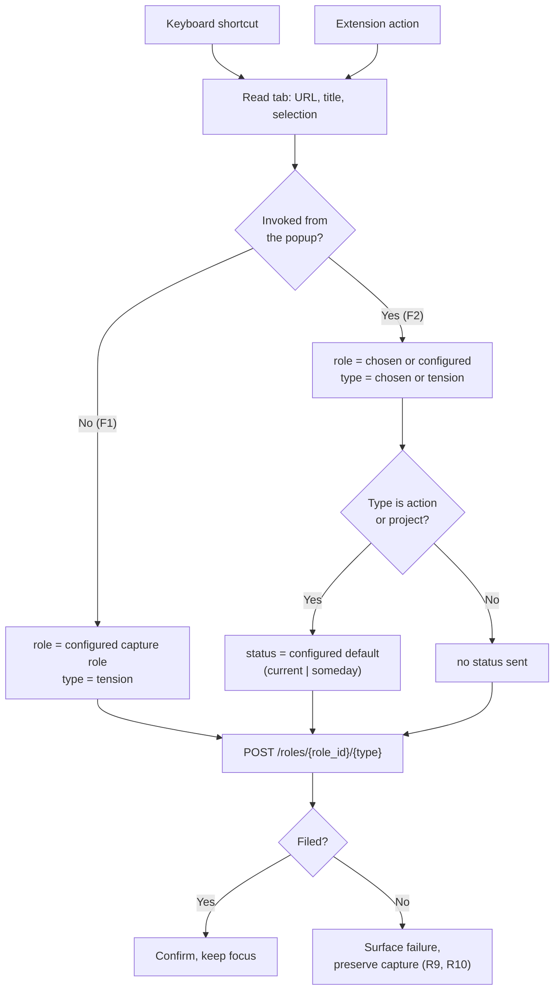
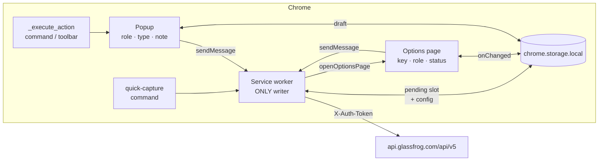
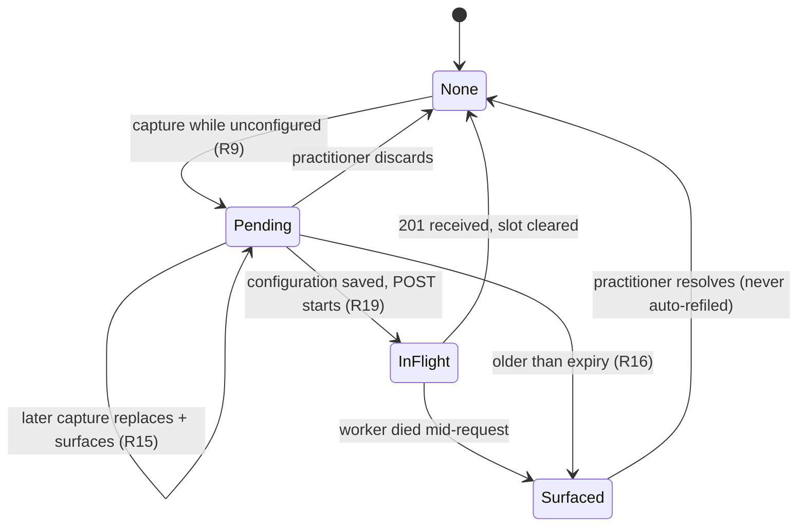
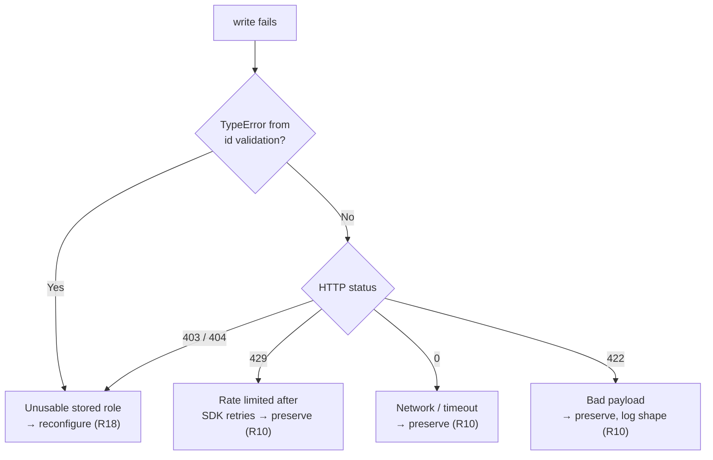

# Zero-Decision Capture Path - Plan

## Goal Capsule

- **Objective** — Ship the Capture surface track: a keystroke that files the current page to GlassFrog as an unprocessed tension with no prompts, and a popup that exposes the same capture with role and work type editable.
- **Product authority** — [STRATEGY.md](STRATEGY.md) (Positioning, Boundaries, Key metrics) and [docs/adr/0002-glassfrog-authentication-and-write-path-for-the-browser-extension.md](docs/adr/0002-glassfrog-authentication-and-write-path-for-the-browser-extension.md).
- **Active scope** — Capture surface only. Role & identity resolution, Round-trip & triage, and Distribution & trust are context, not scope.
- **Means** — a Chrome MV3 extension with one keyboard command filing through the service worker, a second opening a popup for the structured path, and an options page owning configuration (KTD1 for the write path, KD4 and KTD8 for configuration).
- **Authority** — STRATEGY.md is authoritative on product intent; [ADR 0003](../adr/0003-glassfrog-v5-has-no-role-less-write-path.md) on the role constraint; [ADR 0002](../adr/0002-glassfrog-authentication-and-write-path-for-the-browser-extension.md) on auth and the write path. Where this plan and an ADR disagree, the ADR wins and the plan is wrong.
- **Execution profile** — build in unit order; U1 first, since the build is broken in a way that reports success.
- **Stop conditions** — stop and ask if a change would put a decision between sensing and filing, add a permission beyond `activeTab`/`scripting`/`storage`/`notifications`/`alarms`, or make the extension a place to browse a backlog.
- **Tail ownership** — the implementer owns green typecheck, tests, and CI before declaring done.
- **Open blockers** — None. The unconfigured-capture behavior is settled in KD4.

## Product Contract

_Product Contract preservation: unchanged. Planning added R19–R22 as new requirements; no existing R/F/AE ID changed meaning._

### Summary

A single keyboard shortcut files the active tab to GlassFrog as a tension against a capture role the practitioner configures once, where it sits unprocessed until triage. The extension action opens a popup exposing the same capture with role, work type, and a note editable, for captures where the practitioner already knows them. Triage happens in GlassFrog's own unprocessed queue; the extension builds no inbox of its own.

### Problem Frame

Practitioners sense tensions mid-task and lose them to the context switch into GlassFrog. The obvious remedy — a one-keystroke clipper — collides with how GlassFrog v5 actually works.

All three creates are role-scoped in the URL: `POST /roles/{role_id}/tensions`, `/roles/{role_id}/actions`, `/roles/{role_id}/projects`. `role_id` is a path parameter. Request bodies, by contrast, are almost entirely optional — `TensionInput.tension.body`, `ActionInput.action_item.description`, and `ProjectInput.project.description` are all optional.

So the API inverts the expected constraint. Filing with no text is fine. Filing with no role is impossible. A capture path that asks for nothing cannot reach the API unless the role is resolved somewhere other than the capture moment.

### Key Decisions

- KD1. **A capture role is configured once and overridden in the popup, never resolved per-capture.** (session-settled: user-directed — chosen over most-recently-used role and a local staging queue: MRU fails invisibly when context switches mid-session, and a local queue becomes the second GlassFrog client STRATEGY.md Boundaries forbid.) Governs R3, R5.
- KD2. **A capture with no work type files as a tension, which GlassFrog reports as `unprocessed` while it has no associations.** (session-settled: user-directed — chosen over last-used type and over marking auto-defaulted items provisional: the practitioner works GlassFrog's unprocessed queue as their real triage surface, so every defaulted item is seen anyway and a provisional marker carries cost without benefit.) Governs R4.
- KD3. **Actions and projects take a configurable default status, either `current` or `someday`.** (session-settled: user-directed — chosen over hardcoding either: neither maps to `unprocessed`, and which holding state fits depends on the practitioner's own triage rhythm.) Governs R6.

- KD4. **An unconfigured capture opens the options page and carries the pending capture through to filing.** (session-settled: user-directed — chosen over a notification that discards the capture and over blocking capture at install: the first keystroke is where a practitioner decides whether the tool works, so a dead end there is the most expensive failure available.) Governs R9. Holding one pending capture until configuration completes is not the local staging queue KD1 rejected; it has no steady state and nothing accumulates in it.

<!-- ce-section: work-relationships -->
### How This Work Fits Together

This plan owns **Capture surface**, one of four tracks in [STRATEGY.md](STRATEGY.md). The breakdown below is the current understanding, not a committed roadmap; a later plan may revise, split, or discard it.

- **Role & identity resolution** — This plan consumes the track's role *listing* half: v5 role ids are opaque `role_<32 hex>` values a practitioner cannot obtain from the GlassFrog UI, so R8 and R2 both need the caller's role list. It depends on none of the track's role *proposal* half.
  - Still to decide: whether role proposal ever enters the capture path, given STRATEGY.md's Boundaries currently exclude inference there.
- **Round-trip & triage** — Shares the assumption that GlassFrog's unprocessed queue is the triage surface (A2). Can proceed independently of this plan; if A2 proves false, both are affected.
- **Distribution & trust** — Inherits an open question this plan makes harder to reverse: A1 hardens the `@integral-productivity/glassfrog` dependency, and ADR 0002 records that a private-registry build blocks the open-sourcing this track contemplates. OQ3's permission-list answer also feeds its adoption gate.

### Requirements

**Capture invocation**

- R1. Invoking the `quick-capture` command files the active tab without opening the popup or presenting any prompt.
- R2. Opening the extension action presents the same capture with role, work type, and a note editable before filing.
- R14. A capture that files successfully confirms to the practitioner without taking focus from the active tab.

**Attribution and defaults**

- R3. A capture role is read from extension configuration and used as the `role_id` path parameter for every filing that does not name one.
- R4. A capture with no work type set files as a tension, which GlassFrog reports as `unprocessed` until an action, project, proposal, or agenda item is associated with it.
- R5. A role or work type the practitioner sets in the popup is used as given and is never replaced by a configured or defaulted value.
- R6. A capture filed as an action or project uses the practitioner's configured default status, restricted to `current` or `someday`.
- R17. A note the practitioner enters in the popup is carried into the filed item alongside the page evidence.

**Evidence**

- R7. The active tab's URL and title are carried into the filed item, along with the practitioner's text selection when one exists, as untrusted plain text truncated to 4,000 characters and rendered without interpreting markup.
- R11. A filed item carries a marker identifying it as created by the extension, sufficient to distinguish it from items created directly in GlassFrog.
- R13. Extension telemetry carries only timing and outcome fields, never the captured URL, page title, selection text, or the API key.

**Configuration and failure**

- R8. Extension options accept a GlassFrog v5 API key, a capture role selected from the practitioner's own roles, and the default action/project status.
- R9. A capture invoked while the extension is unconfigured opens the options page holding the pending capture in extension storage, and files it once a capture role and API key are saved.
- R10. A capture that fails after configuration — a rejected request or a network failure — surfaces the failure and preserves the captured content rather than discarding it.
- R12. A surfaced or logged failure never includes the GlassFrog API key or the request headers carrying it.
- R15. At most one pending capture is held; a later unconfigured capture replaces it, and the replacement is surfaced to the practitioner rather than dropped silently.
- R16. A pending capture is cleared when its item files, and is surfaced rather than retained indefinitely when the practitioner leaves the options page without saving.
- R18. A failure caused by an unusable capture role is distinguished from a transient failure, directing the practitioner to reconfigure rather than retry.
- R19. A capture is filed at most once, even when the extension loses the result of a request the server already accepted.
- R20. Role, work type, and note entered in the popup survive the popup closing, and are restored when it reopens.
- R21. A configuration attempt that cannot complete — a rejected API key, or an account with no roles to choose from — says so plainly instead of leaving the practitioner on an empty form.
- R22. The extension detects that its capture shortcut failed to register and tells the practitioner, rather than appearing to do nothing.

### Key Flows

- F1. **Quick capture.**
  - **Trigger:** the `quick-capture` keyboard command.
  - **Steps:** read active tab URL, title, and selection → read configured capture role and API key → `POST /roles/{role_id}/tensions` → confirm without stealing focus.
  - **Outcome:** an unprocessed tension on the capture role, with the page as evidence. No prompt was shown.
  - **Covers R1, R3, R4, R7, R9, R11, R14.**

- F2. **Structured capture.**
  - **Trigger:** the extension action.
  - **Steps:** present the same captured context → practitioner optionally sets role, work type, and note → file to the matching endpoint for the chosen work type, applying the configured default status when the type is action or project.
  - **Outcome:** an item filed with the attribution the practitioner supplied, on the role they named.
  - **Covers R2, R5, R6, R7, R11, R14, R17.**

### Acceptance Examples

- AE1. **Given** no capture role is configured, **when** the practitioner invokes the shortcut, **then** the options page opens with the capture held, and the item files as soon as a capture role and API key are saved. **Covers R9.**
- AE2. **Given** the practitioner has text selected, **when** they invoke the shortcut, **then** the filed tension carries the selection alongside the page URL and title. **Covers R7.**
- AE3. **Given** the default action/project status is `someday`, **when** the practitioner files an action from the popup, **then** the action is created with `status: someday`. **Covers R6.**
- AE4. **Given** a capture role is configured, **when** the practitioner names a different role in the popup, **then** the item is filed against the named role and the configured role is not used. **Covers R5.**
- AE5. **Given** the practitioner opens the popup and changes nothing, **when** they file, **then** the result matches what the shortcut would have produced. **Covers R2, R4.**
- AE6. **Given** the extension is configured, **when** the API rejects the request, **then** the failure is surfaced and the captured content is not discarded, and the surfaced failure contains no API key. **Covers R10, R12.**
- AE7. **Given** the extension is configured, **when** a capture files successfully, **then** the practitioner is confirmed without focus leaving the active tab. **Covers R14.**
- AE8. **Given** the practitioner types a note in the popup, **when** they file, **then** the note is carried into the filed item alongside the page evidence. **Covers R17.**
- AE9. **Given** one capture is already pending configuration, **when** the practitioner invokes the shortcut again, **then** the new capture replaces the held one and the replacement is surfaced. **Covers R15.**

### Scope Boundaries

**Deferred for later**

- Telemetry instrumentation (issue #3). No unit here implements it; R13 governs it when it is built, and this plan's Definition of Done already forbids the API key reaching any telemetry field.
- Mobile share-sheet capture (issue #4).
- AI-suggested role or work type (issue #5).
- Proposing a sensing role from page content or history — the Role & identity resolution track.

**Outside this product's identity**

- Any grooming, editing, or backlog-browsing surface. Triage happens in GlassFrog.
- Filing into any system other than GlassFrog (issue #6).

### Success Criteria

- Time-to-capture p95 stays low enough that F1 does not interrupt the practitioner's task. Measured in extension telemetry (issue #3).
- Capture failure rate — the share of F1 invocations that do not produce a filed item — is measurable. Abandonment is measured on F2, where the practitioner can open the surface and leave without filing.
- Structure-at-capture rate is measurable and non-trivial. This is the falsification test for STRATEGY.md's positioning: if it sits near zero, the popup path is not reachable enough and "never discard" is aspirational.
- Triage survival rate is computable, which requires filed items to be distinguishable from items created by other means (R11, issue #3).
- Before the capture path ships, the practitioner's existing GlassFrog unprocessed-tension queue is observed, so A2 is tested against current behavior rather than only after clipped items exist.

### Dependencies and Assumptions

- A1. `@integral-productivity/glassfrog` exposes the three role-scoped creates and the authenticated caller's role list (`GET /me/roles`), and is bundleable into an MV3 service worker (ADR 0002).
- A2. GlassFrog's unprocessed-tension queue is the practitioner's working triage surface. Load-bearing: KD2, the Round-trip & triage track, and the triage survival criterion all rest on it. Stated by the practitioner, not yet observed in data.
- A3. `host_permissions` scoped to `https://api.glassfrog.com/*` is sufficient for the service worker to call the API.

### Outstanding Questions

None block implementation. Planning resolved OQ2 (evidence placement — KTD5), OQ3 (selection permission — KTD6), OQ5 (retry semantics — KTD7 forbids auto-refiling, so a preserved capture is surfaced and retried by the practitioner; the SDK's internal 429 retry is the only automatic one), OQ6 (pending-capture storage — KTD3), and OQ7 (unreadable tabs — a capture that cannot read its tab fails visibly rather than filing an empty tension, verified manually in U5).

**Deferred to implementation**

- OQ4. Whether `meeting_type` (`tactical`, `governance`, `null`) is set at capture or left null for triage. Null is the current behavior; changing it is a one-field addition in U4.

**Deferred to product**

- OQ8. Threshold values for the success criteria — what p95 time-to-capture counts as non-interrupting, what structure-at-capture rate is non-trivial, and over what window each is judged. Needed to interpret the metrics, not to build them.

### Sources / Research

- `glassfrog-sdk-ts` repo, `src/types/generated.ts` — generated OpenAPI types for GlassFrog v5. Establishes that `createTension`, `createAction`, and `createRoleProject` all take `role_id` as a path parameter, and that their request bodies are optional throughout.
- `glassfrog-sdk-ts` repo, `src/client.ts` — v5 auth is `X-Auth-Token` against `https://api.glassfrog.com/api/v5`. There is no OAuth.
- `glassfrog-mcp-server` repo, `docs/adr/0002-oauth2-embedded-auth-server.md` — prior art confirming the absence of upstream OAuth; that repo built its own authorization server wrapping the user's v5 key.
- Status vocabularies, verbatim from the schema: tensions take `unprocessed | processed | archived`; actions and projects take `archived | cancelled | completed | current | scheduled | someday | waiting`. No shared value exists between them, which is what forces KD3.
- Tension status is server-derived. The schema states that `unprocessed` and `processed` are "auto-computed from the presence of associated actions/projects/proposals/agenda-items" and that clients may set only `archived`, via PATCH. The extension therefore never sends a tension status; a new tension reports as `unprocessed` because it has no associations.

---

## Planning Contract

### Key Technical Decisions

- KTD1. **The service worker performs every write; the popup and options page send it a message and receive an outcome.** One writer means one place that clears the pending slot, one place that classifies failure, and no request that dies with a closing document. Chrome destroys a popup on blur with no way to prevent it, so a popup-owned `fetch` loses captures the practitioner already committed to. Governs R1, R2, R10, R19.
- KTD2. **Success confirms on the action badge; failure raises a notification.** (session-settled: user-directed — chosen over badge-only and over popup-only failure detail: a badge cannot carry which of four failures occurred, and R18 requires the practitioner learn that an unusable role needs reconfiguring rather than a retry.) The badge costs no permission and cannot steal focus; `notifications` adds a "Display notifications" install warning, accepted as the price of legible failure. Governs R14, R10, R18.
- KTD3. **The pending capture lives in one fixed `chrome.storage.local` key, overwritten rather than appended, with a `capturedAt` expiry of 7 days — long enough to cover leaving GlassFrog to fetch an API key and returning.** (session-settled: user-directed — chosen over `chrome.storage.session` and over `local` with no expiry: `session` is cleared by extension reload, disable, update, and browser restart, which are exactly the events first-run troubleshooting produces.) The single slot and the expiry are what keep KD4's hold from becoming the accumulating inbox KD1 rejects. Governs R9, R15, R16.
- KTD4. **The popup gets its own `chrome.commands` entry.** (session-settled: user-directed — chosen over leaving F2 mouse-only: `_execute_action` does not fire `onCommand` and cannot be the quick-capture command, so without a second entry the structured path is mouse-only — and structure-at-capture rate is the plan's own falsification test for the positioning.) Governs R2, R20.
- KTD5. **The provenance marker and the page title ride in the tension's `label`; the note and page evidence ride in `body`.** (session-settled: user-directed — chosen over composing everything into `body`: GlassFrog exposes no provenance field and tags are read-only at create, so the marker must be text. Keeping it in a separate field means truncating a long selection can never silently destroy it.) Governs R7, R11, R17.
- KTD6. **Selection is read with `chrome.scripting.executeScript` on the invoking gesture, not a declared content script.** `activeTab` alone yields `url` and `title` but not the selection; a keyboard command is a qualifying gesture. A declared content script would need `matches` broad enough to be `<all_urls>`, buying the broad-access install warning `activeTab` exists to avoid. Final permission list: `activeTab`, `scripting`, `storage`, `notifications`. Governs R7. Resolves OQ3.
- KTD7. **At-most-once is enforced by an in-flight marker written before the POST and keyed by a per-capture id, so concurrent captures cannot clear each other's record; a capture found in-flight at startup is surfaced, never auto-refiled — and the client is constructed with `maxRetries: 0`, since the SDK's backoff timer does not keep the worker alive. There is no automatic retry.** GlassFrog v5 has no idempotency key, and the worker can die between a successful POST and the storage clear. Auto-refiling would silently duplicate tensions on the capture role and corrupt the triage-survival metric; surfacing hands the ambiguity to the one party who can resolve it. Governs R19.
- KTD8. **The API key is validated at save time with `me.get({ include: ['roles'] })`, which also populates the role picker.** One call proves the key and supplies the roles, and it is the same probe `glassfrog-mcp-server` uses at `api/oauth/authorize.ts`. Governs R8, R21.
- KTD9. **Failures classify four ways, not two.** `TypeError` from the SDK's id validation means a malformed stored role id and never reaches the network; `403`/`404` on the role path means an unusable role; `429` is rate limiting the SDK already retried; `status: 0` is network or timeout. R18's reconfigure path belongs to the first two only. Governs R10, R18.

### High-Level Technical Design

Three extension contexts, one writer.

The pending capture's lifecycle is what keeps KD4's promise without becoming a queue.

Failure classification drives whether the practitioner is told to retry or to reconfigure.

### Assumptions

- A4. The `@integral-productivity/glassfrog` SDK at `^0.6.0` is the version the extension builds against. The local `glassfrog-sdk-ts` working copy is on a stale May branch at 0.1.0 with different signatures — read `origin/main`, not the working tree. `origin/main` also carries an unreleased BREAKING change wrapping `me.get()` in a `data` envelope, shipping in 0.7.0. Against the pinned `^0.6.0`, read roles from the bare `{ actor, organization, membership, roles? }` shape, not `result.data.roles`.
- A5. A practitioner has at least one primary, non-discarded role assignment. `GET /me/roles` returns only those; an account without one cannot complete R8, which is why R21 requires saying so rather than rendering an empty picker.

### Sequencing

U1 first — the build is currently broken in a way that reports success, so every later unit would be validated against a bundle that cannot load. U2 establishes the storage contract every other unit reads. U3 and U4 can proceed in parallel once U2 lands. U5 and U6 depend on U4. U7 depends on U2 and U4. U8 is independent and can land any time after U1.

---

## Implementation Units

### U1. Repair the build and dependency contract

- **Goal:** `npm run build` produces a bundle an MV3 service worker can actually load, against the current SDK.
- **Requirements:** prerequisite for every unit; unblocks A1 and A4.
- **Dependencies:** none.
- **Files:** `tsup.config.ts`, `package.json`, `package-lock.json`, `.npmrc`, `public/manifest.json`
- **Approach:**
  1. Add `noExternal` to `tsup.config.ts` so the SDK is bundled rather than left as a bare specifier. tsup externalizes everything in `dependencies` by default.
  2. Bump `@integral-productivity/glassfrog` to `^0.6.0`; `^0.1.0` resolves to `<0.2.0` under npm's 0.x caret rule.
  3. Add `//npm.pkg.github.com/:_authToken=${NODE_AUTH_TOKEN}` to `.npmrc` — the scope mapping alone resolves anonymously and 401s.
  4. Raise `engines.node` to `>=22.18`, the floor at which `node --test` discovers `.ts` files.
  5. Add `minimum_chrome_version` to the manifest matching the tsup target, so the supported floor is declared in one place.
  6. Generate `package-lock.json` on Linux via the org's documented Docker recipe, so CI in U8 can run `npm ci`.
- **Patterns to follow:** `glassfrog-productboard-plugin` pins `^0.5.0` and is the closest current consumer.
- **Test expectation:** none — build and dependency configuration. Proof is the runtime check in Verification.
- **Verification:** the built `dist/background.js` contains no bare `@integral-productivity/glassfrog` import, and the unpacked extension loads in Chrome without a service-worker registration error.

### U2. Storage contract and configuration module

- **Goal:** one module owns every storage key, so no other unit invents its own.
- **Requirements:** R8, R9, R15, R16, R20. Implements KTD3.
- **Dependencies:** U1.
- **Files:** `src/storage.ts`, `test/storage.test.ts`
- **Approach:**
  1. Define keys for the API key, capture role, the practitioner's role list (cached at validation, for the popup's role override), default action/project status, the single pending-capture slot, in-flight markers keyed by capture id, and the popup draft.
  2. Pending-capture writes always target the one fixed key — replace, never append — and carry `capturedAt`.
  3. Expose an `isConfigured` check that reports *which* of key and role is missing, since R21 and the two-phase save in U3 both need the distinction.
  4. Call `setAccessLevel({ accessLevel: 'TRUSTED_CONTEXTS' })` on the local area, guarded by a `typeof` feature check — it is a later addition on `local` than on `session`, and an unguarded call throws at module init and takes every capture path with it.
- **Test scenarios:**
  - Writing a second pending capture replaces the first and leaves exactly one slot occupied.
  - A pending capture older than KTD3's 7-day expiry is reported as expired rather than returned as current.
  - `isConfigured` reports key-present-role-missing distinctly from both-missing.
  - Reading a pending capture when none exists returns absent, not a throw.
- **Verification:** every other unit reads storage only through this module; no other file references a raw storage key.

### U3. Options page

- **Goal:** the surface that makes configuration possible at all — currently absent from the manifest and the source tree.
- **Requirements:** R7, R8, R9, R15, R16, R21. Covers AE1, AE9. Implements KD4, KTD8.
- **Dependencies:** U2.
- **Files:** `public/manifest.json`, `public/options.html`, `src/options.ts`, `tsup.config.ts`, `test/options-config.test.ts`
- **Approach:**
  1. Add `options_ui` with `open_in_tab: true`, an options entry to the tsup config, and the HTML document.
  2. On save, validate the key with `me.get({ include: ['roles'] })`, cache the returned roles for the popup, and populate the role picker. A rejected key and an empty role list get distinct, plain-language messages (R21). Disable Save while the call is in flight.
  3. Render every page-derived and GlassFrog-derived string with `textContent`, never `innerHTML` — this page holds the API key (R7).
  4. Read the pending capture on load **and** register a `chrome.storage.onChanged` listener — `openOptionsPage()` may only focus an already-open page, in which case the load-time read never runs and AE9 silently fails.
  5. When configuration becomes valid and a capture is pending, send the service worker the file-capture message defined in `src/messages.ts` (KTD1); the options page never writes to GlassFrog itself.
- **Patterns to follow:** `glassfrog-mcp-server` `api/oauth/authorize.ts` for the key-validation probe and its status branching.
- **Test scenarios:**
  - Covers AE1. Saving a valid key and role with a capture pending files that capture.
  - Covers AE9. A pending capture arriving while the options page is already open updates the displayed capture.
  - A rejected key surfaces "that key wasn't accepted" and does not populate the picker.
  - An account whose role list comes back empty says so, rather than rendering an empty dropdown.
  - Saving a key without choosing a role leaves configuration incomplete and does not file the pending capture.
  - A pending capture whose page title contains `` renders as literal text.
- **Verification:** a practitioner can go from a fresh install to a filed capture without leaving the options page except to fetch their key.

### U4. Service-worker capture core

- **Goal:** the single write path both flows go through.
- **Requirements:** R1, R3, R4, R7, R11, R17, R19. Covers AE2. Implements KTD1, KTD5, KTD6, KTD7.
- **Dependencies:** U2.
- **Files:** `public/manifest.json`, `src/background.ts`, `src/capture.ts`, `src/glassfrog.ts`, `src/compose.ts`, `src/messages.ts`, `test/compose.test.ts`, `test/capture.test.ts`
- **Approach:**
  1. Register `onCommand` and `onMessage` listeners at top level — a listener registered after an `await` is missed on a cold start, which is exactly the first keystroke after idle.
  2. Add `scripting` to the manifest permission list — `chrome.scripting.executeScript` throws without it.
  3. Read `url` and `title` from the tab; read the selection via `chrome.scripting.executeScript` in the same turn, before any network await, since `activeTab` is revoked on cross-origin navigation.
  4. Truncate URL, title, and selection to R7's cap **before** the pending-slot write, not only at compose time — an untruncated selection can exceed the storage quota and lose the capture.
  5. Compose fields per KTD5, branching by work type: for a tension, marker and title into `label`, note then evidence into `body`; for an action or project, marker and title into `description`, note then evidence into `note`. The marker is never truncated.
  6. Define the file-capture request and outcome types in `src/messages.ts`; U3 and U7 import them rather than defining their own.
  7. Construct the client with `maxRetries: 0` — the SDK's 429 backoff is a plain timer with no in-flight request keeping the worker alive, so Chrome can kill it mid-backoff.
  8. Write the in-flight marker before the POST, keyed by a capture id generated at capture time, and clear it with the pending slot only after a 201 (KTD7).
  9. Delete the stale `resolveWorkType` stub — KD2 settled against the `provisional` flag its TODO argues for.
- **Execution note:** implement the field composition test-first; it is pure and it is where R11 fails silently if truncation is wrong.
- **Test scenarios:**
  - Covers AE2. A capture with a selection carries URL, title, and selection into the filed item.
  - The provenance marker survives composition when the selection exceeds the length limit.
  - A capture with no work type files as a tension and sends no `status`.
  - A capture on a tab with no selection files successfully with evidence but no selection block.
  - The in-flight marker is present before the request and absent after a success.
  - Two overlapping captures each own a marker; the first completing does not clear the second.
  - A multi-megabyte selection is truncated before it reaches storage.
  - An action composes the marker into `description` and the evidence into `note`.
  - A capture whose POST succeeds but whose clear never runs leaves an in-flight marker, not a cleared slot.
- **Verification:** a filed tension in GlassFrog carries the marker, the page URL, and the title; the pending slot is empty afterward.

### U5. Confirmation and failure surfacing

- **Goal:** the practitioner learns what happened without losing their place.
- **Requirements:** R10, R12, R14, R18, R22. Covers AE6, AE7. Implements KTD2, KTD9.
- **Dependencies:** U4.
- **Files:** `public/manifest.json`, `src/notify.ts`, `src/errors.ts`, `test/errors.test.ts`
- **Approach:**
  1. Add `notifications` and `alarms` to the manifest permission list.
  2. Success sets badge text and colour; clear it on a `chrome.alarms` tick, not `setTimeout` — the worker may be dead before a timer fires.
  3. Classify failures four ways per KTD9 and route unusable-role to a reconfigure message and the rest to preserve-and-retry.
  4. Surface only the error's message and status; never the request headers. The SDK's error type carries no headers, so R12 holds as long as nothing logs the client options.
  5. At startup, compare `chrome.commands.getAll()` against the manifest and notify when the capture shortcut failed to bind (R22).
- **Test scenarios:**
  - Covers AE6. A rejected request surfaces the failure and leaves the captured content preserved.
  - Covers AE7. A successful capture updates the badge and does not open a window or take focus.
  - A `TypeError` from id validation classifies as unusable-role, not as transient.
  - A `403` on the role path classifies as unusable-role; a `status: 0` classifies as transient.
  - No surfaced or logged failure string contains the API key.
  - An unbound capture shortcut produces a notification at startup.
- **Verification:** each of the four failure classes produces a distinguishable message, and the API key appears in no log or notification.

### U6. Pending-capture lifecycle

- **Goal:** KD4's promise holds across service-worker death, repeat captures, and abandonment.
- **Requirements:** R9, R15, R16, R19. Covers AE9. Implements KTD3, KTD7.
- **Dependencies:** U4.
- **Files:** `src/pending.ts`, `src/background.ts`, `test/pending.test.ts`
- **Approach:**
  1. An unconfigured capture writes the pending slot, then calls `openOptionsPage()`.
  2. A later unconfigured capture replaces the slot and surfaces the replacement (R15) rather than dropping it silently.
  3. On worker startup, an in-flight marker is surfaced for the practitioner to resolve — never auto-refiled (KTD7).
  4. A pending capture past its expiry is surfaced, not silently deleted (R16).
  5. Generalize the auto-file trigger from "was unconfigured" to "a capture is held and configuration just became valid", so the R18 reconfigure path re-files too.
- **Test scenarios:**
  - A second unconfigured capture replaces the first and the replacement is surfaced.
  - An in-flight marker found at startup is surfaced and no request is issued.
  - A pending capture older than KTD3's 7-day expiry is surfaced rather than filed or dropped.
  - Reconfiguring after an unusable-role failure files the preserved capture.
  - Configuration saved with no pending capture files nothing.
- **Verification:** no ordering of capture, restart, and reconfigure produces either a duplicate tension or a silently lost capture.

### U7. Popup and the structured path

- **Goal:** the same capture, more of it revealed — and nothing typed is lost.
- **Requirements:** R2, R5, R6, R7, R9, R11, R17, R20. Covers AE3, AE4, AE5, AE8. Implements KTD4.
- **Dependencies:** U2, U4.
- **Files:** `public/manifest.json`, `public/popup.html`, `src/popup.ts`, `test/popup-draft.test.ts`
- **Approach:**
  1. Add a reserved `_execute_action` command entry so the shortcut opens the popup directly. A custom-named entry would fire `onCommand` and then need `chrome.action.openPopup()`, which requires Chrome 127 against a `chrome120` target.
  2. On open, check configuration; when incomplete, write the pending capture and route to the options page exactly as U6 does for the shortcut (R9).
  3. Render role, work type, and note; populate the role selector from U2's cached role list, since role ids are opaque hex a practitioner cannot type. Default role and status from configuration but never overwrite a value the practitioner set (R5). Render page-derived strings with `textContent` (R7).
  4. Persist the draft to storage on every change and restore it on open; clear it on a successful file (R20).
  5. Hand the capture to the service worker using the `src/messages.ts` types and treat the response as best-effort — the popup may be gone before it arrives (KTD1).
- **Test scenarios:**
  - Covers AE3. Filing an action with the default status set to `someday` creates it with `someday`.
  - Covers AE4. Naming a different role files against that role and not the configured one.
  - Covers AE5. Opening the popup and changing nothing produces the same fields the shortcut would have.
  - Covers AE8. A typed note is carried into the filed item.
  - A draft typed and then abandoned is restored when the popup reopens.
  - A successful file clears the draft.
  - The role selector lists the practitioner's roles rather than requiring a typed id.
  - Opening the popup on an unconfigured extension routes to the options page rather than rendering an empty form.
  - A page title containing markup renders as literal text.
- **Verification:** a practitioner can type a note, click away, reopen the popup, and find their note intact.

### U8. CI and lockfile

- **Goal:** the capture path has regression safety, since most of its failure modes are silent.
- **Requirements:** supports the Verification Contract.
- **Dependencies:** U1.
- **Files:** `.github/workflows/ci.yml`
- **Approach:**
  1. A workflow with `actions/setup-node` pinned to Node 22.18 and `registry-url: https://npm.pkg.github.com`, running `npm ci`, `npm run typecheck`, `npm test`, and `npm run build` on push and pull request.
  2. Provide the registry token as both an Actions secret and a Dependabot secret — a Dependabot-triggered run cannot read Actions secrets and will 401 on `npm.pkg.github.com`.
  3. Add a fail-loud guard step that errors with a clear message when the token resolves empty.
- **Patterns to follow:** the org's recorded GitHub Packages CI gotchas — SAML SSO authorization on the PAT, and the separate Dependabot secret store.
- **Test expectation:** none — CI configuration. Proof is a green run.
- **Verification:** CI passes on a pull request, and a Dependabot pull request does not fail at the install step.

---

## Verification Contract

| Gate | Command | Applies to | Done signal |
|---|---|---|---|
| Types | `npm run typecheck` | all units | no errors under `strict` + `noUncheckedIndexedAccess` |
| Tests | `npm test` (`node --test`) | U2, U3, U4, U5, U6, U7 | all scenarios above pass **and the run reports a non-zero test count** |
| Build | `npm run build` | U1, U3, U7 | `dist/` loads unpacked with no service-worker registration error |
| Bundle | inspect `dist/background.js` | U1 | contains no bare `@integral-productivity/glassfrog` specifier |
| Manual | load unpacked, capture on a real page | U4, U5, U6, U7 | a tension appears in GlassFrog carrying the marker, URL, and title |
| Manual | capture on a `chrome://` tab | U5 | fails visibly rather than filing an empty tension |
| CI | `.github/workflows/ci.yml` | U8 | green on a pull request and on a Dependabot pull request |

GlassFrog writes are not mocked at the boundary. Tests use a fake client behind a narrow local interface, mirroring the `SdkGlassFrogReader` adapter in `glassfrog-productboard-plugin` — it is what makes the capture path testable without network.

---

## Definition of Done

**Global**

- All 22 requirements are implemented or explicitly deferred in writing.
- The practitioner's existing GlassFrog unprocessed-tension queue has been observed and A2 confirmed before the capture path ships.
- Every gate in the Verification Contract passes.
- A practitioner can install the extension, configure it, and file a capture without reading the source.
- No abandoned or experimental code from approaches that did not pan out remains in the diff.
- The API key appears in no log, notification, error string, or telemetry field.
- Only `activeTab`, `scripting`, `storage`, `notifications`, and `alarms` are requested, plus the `https://api.glassfrog.com/*` host permission A3 requires. Any addition is a stop condition, not an implementation detail. `alarms`, unlike `notifications`, carries no install warning.

**Per unit**

| Unit | Done when |
|---|---|
| U1 | the built bundle loads in Chrome and the lockfile was generated on Linux |
| U2 | no file outside `src/storage.ts` references a raw storage key |
| U3 | fresh install → configured → filed, with rejected-key and empty-role-list paths both exercised |
| U4 | a filed tension carries marker, URL, and title, and the marker survives a truncated selection |
| U5 | all four failure classes are distinguishable, and an unbound shortcut is reported |
| U6 | no ordering of capture, restart, and reconfigure yields a duplicate or a lost capture |
| U7 | a note survives the popup closing and reopening |
| U8 | CI green on a pull request and on a Dependabot pull request |
