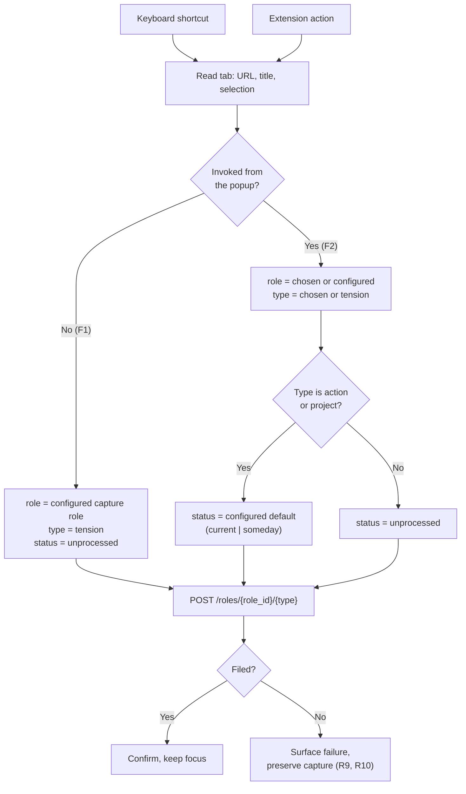

# Zero-Decision Capture Path - Plan

## Goal Capsule

- **Objective** — Ship the Capture surface track: a keystroke that files the current page to GlassFrog as an unprocessed tension with no prompts, and a popup that exposes the same capture with role and work type editable.
- **Product authority** — [STRATEGY.md](STRATEGY.md) (Positioning, Boundaries, Key metrics) and [docs/adr/0002-glassfrog-authentication-and-write-path-for-the-browser-extension.md](docs/adr/0002-glassfrog-authentication-and-write-path-for-the-browser-extension.md).
- **Active scope** — Capture surface only. Role & identity resolution, Round-trip & triage, and Distribution & trust are context, not scope.
- **Open blockers** — None. The unconfigured-capture behavior is settled in KD4.

## Product Contract

### Summary

A single keyboard shortcut files the active tab to GlassFrog as a tension with `status: unprocessed`, against a capture role the practitioner configures once. The extension action opens a popup exposing the same capture with role and work type editable, for captures where the practitioner already knows them. Triage happens in GlassFrog's own unprocessed queue; the extension builds no inbox of its own.

### Problem Frame

Practitioners sense tensions mid-task and lose them to the context switch into GlassFrog. The obvious remedy — a one-keystroke clipper — collides with how GlassFrog v5 actually works.

All three creates are role-scoped in the URL: `POST /roles/{role_id}/tensions`, `/roles/{role_id}/actions`, `/roles/{role_id}/projects`. `role_id` is a path parameter. Request bodies, by contrast, are almost entirely optional — `TensionInput.tension.body`, `ActionInput.action_item.description`, and `ProjectInput.project.description` are all optional.

So the API inverts the expected constraint. Filing with no text is fine. Filing with no role is impossible. A capture path that asks for nothing cannot reach the API unless the role is resolved somewhere other than the capture moment.

### Key Decisions

- KD1. **A capture role is configured once and overridden in the popup, never resolved per-capture.** (session-settled: user-directed — chosen over most-recently-used role and a local staging queue: MRU fails invisibly when context switches mid-session, and a local queue becomes the second GlassFrog client STRATEGY.md Boundaries forbid.) Governs R3, R5.
- KD2. **A capture with no work type files as a tension with `status: unprocessed`.** (session-settled: user-directed — chosen over last-used type and over marking auto-defaulted items provisional: the practitioner works GlassFrog's unprocessed queue as their real triage surface, so every defaulted item is seen anyway and a provisional marker carries cost without benefit.) Governs R4.
- KD3. **Actions and projects take a configurable default status, either `current` or `someday`.** (session-settled: user-directed — chosen over hardcoding either: neither maps to `unprocessed`, and which holding state fits depends on the practitioner's own triage rhythm.) Governs R6.

- KD4. **An unconfigured capture opens the options page and carries the pending capture through to filing.** (session-settled: user-directed — chosen over a notification that discards the capture and over blocking capture at install: the first keystroke is where a practitioner decides whether the tool works, so a dead end there is the most expensive failure available.) Governs R9. Holding one pending capture until configuration completes is not the local staging queue KD1 rejected; it has no steady state and nothing accumulates in it.

<!-- ce-section: work-relationships -->
### How This Work Fits Together

This plan owns **Capture surface**, one of four tracks in [STRATEGY.md](STRATEGY.md). The breakdown below is the current understanding, not a committed roadmap; a later plan may revise, split, or discard it.

- **Role & identity resolution** — Enables a richer version of R3 (proposing a role rather than reading a configured one). This plan depends on none of it: a configured role is sufficient.
  - Still to decide: whether role proposal ever enters the capture path, given STRATEGY.md's Boundaries currently exclude inference there.
- **Round-trip & triage** — Shares the assumption that GlassFrog's unprocessed queue is the triage surface (A2). Can proceed independently of this plan; if A2 proves false, both are affected.
- **Distribution & trust** — Can proceed independently of this plan. Its open question is packaging, tracked separately.

### Requirements

**Capture invocation**

- R1. Invoking the `quick-capture` command files the active tab without opening the popup or presenting any prompt.
- R2. Opening the extension action presents the same capture with role and work type editable before filing.

**Attribution and defaults**

- R3. A capture role is read from extension configuration and used as the `role_id` path parameter for every filing that does not name one.
- R4. A capture with no work type set files as a tension with `status: unprocessed`.
- R5. A role or work type the practitioner sets in the popup is used as given and is never replaced by a configured or defaulted value.
- R6. A capture filed as an action or project uses the practitioner's configured default status, restricted to `current` or `someday`.

**Evidence**

- R7. The active tab's URL and title are carried into the filed item, along with the practitioner's text selection when one exists.

**Configuration and failure**

- R8. Extension options accept a GlassFrog v5 API key, a capture role, and the default action/project status.
- R9. A capture invoked while the extension is unconfigured opens the options page holding the pending capture, and files it once a capture role and API key are saved.
- R10. A capture that fails after configuration — a rejected request or a network failure — surfaces the failure and preserves the captured content rather than discarding it.

### Key Flows

- F1. **Quick capture.**
  - **Trigger:** the `quick-capture` keyboard command.
  - **Steps:** read active tab URL, title, and selection → read configured capture role and API key → `POST /roles/{role_id}/tensions` with `status: unprocessed` → confirm without stealing focus.
  - **Outcome:** an unprocessed tension on the capture role, with the page as evidence. No prompt was shown.
  - **Covers R1, R3, R4, R7, R9.**

- F2. **Structured capture.**
  - **Trigger:** the extension action.
  - **Steps:** present the same captured context → practitioner optionally sets role, work type, and note → file to the matching endpoint for the chosen work type, applying the configured default status when the type is action or project.
  - **Outcome:** an item filed with the attribution the practitioner supplied, on the role they named.
  - **Covers R2, R5, R6, R7.**

### Acceptance Examples

- AE1. **Given** no capture role is configured, **when** the practitioner invokes the shortcut, **then** the options page opens with the capture held, and the item files as soon as a capture role and API key are saved. **Covers R9.**
- AE2. **Given** the practitioner has text selected, **when** they invoke the shortcut, **then** the filed tension carries the selection alongside the page URL and title. **Covers R7.**
- AE3. **Given** the default action/project status is `someday`, **when** the practitioner files an action from the popup, **then** the action is created with `status: someday`. **Covers R6.**
- AE4. **Given** a capture role is configured, **when** the practitioner names a different role in the popup, **then** the item is filed against the named role and the configured role is not used. **Covers R5.**
- AE5. **Given** the practitioner opens the popup and changes nothing, **when** they file, **then** the result matches what the shortcut would have produced. **Covers R2, R4.**
- AE6. **Given** the extension is configured, **when** the API rejects the request, **then** the failure is surfaced and the captured content is not discarded. **Covers R10.**

### Scope Boundaries

**Deferred for later**

- Mobile share-sheet capture (issue #4).
- AI-suggested role or work type (issue #5).
- Proposing a sensing role from page content or history — the Role & identity resolution track.

**Outside this product's identity**

- Any grooming, editing, or backlog-browsing surface. Triage happens in GlassFrog.
- Filing into any system other than GlassFrog (issue #6).

### Success Criteria

- Time-to-capture p95 stays low enough that F1 does not interrupt the practitioner's task. Measured in extension telemetry (issue #3).
- Capture abandonment rate is measurable and near zero for F1, which presents nothing to abandon.
- Structure-at-capture rate is measurable and non-trivial. This is the falsification test for STRATEGY.md's positioning: if it sits near zero, the popup path is not reachable enough and "never discard" is aspirational.
- Triage survival rate is computable, which requires filed items to be distinguishable from items created by other means (issue #3).

### Dependencies and Assumptions

- A1. `@integral-productivity/glassfrog` exposes the three role-scoped creates and is bundleable into an MV3 service worker (ADR 0002).
- A2. GlassFrog's unprocessed-tension queue is the practitioner's working triage surface. Load-bearing: KD2, the Round-trip & triage track, and the triage survival criterion all rest on it. Stated by the practitioner, not yet observed in data.
- A3. `host_permissions` scoped to `https://api.glassfrog.com/*` is sufficient for the service worker to call the API.

### Outstanding Questions

None block planning.

**Deferred to Planning**

- OQ2. Where page evidence lands in a tension: `TensionInput.tension.body`, `TensionInput.tension.label`, or both. `label` exists in v5 and is unused by the current design.
- OQ3. Whether reading the practitioner's selection needs a content script, or whether `activeTab` alone suffices for F1. Affects the manifest's permission list, which the Distribution & trust track treats as an adoption gate.
- OQ4. Whether `meeting_type` (`tactical`, `governance`, `null`) should be set at capture or left null for triage.
- OQ5. Retry semantics for R10 — whether a post-configuration failure retries automatically, holds for manual retry, or only reports. R10 fixes the intent; the mechanism is a planning choice.

### Sources / Research

- `glassfrog-sdk-ts` repo, `src/types/generated.ts` — generated OpenAPI types for GlassFrog v5. Establishes that `createTension`, `createAction`, and `createRoleProject` all take `role_id` as a path parameter, and that their request bodies are optional throughout.
- `glassfrog-sdk-ts` repo, `src/client.ts` — v5 auth is `X-Auth-Token` against `https://api.glassfrog.com/api/v5`. There is no OAuth.
- `glassfrog-mcp-server` repo, `docs/adr/0002-oauth2-embedded-auth-server.md` — prior art confirming the absence of upstream OAuth; that repo built its own authorization server wrapping the user's v5 key.
- Status vocabularies, verbatim from the schema: tensions take `unprocessed | processed | archived`; actions and projects take `archived | cancelled | completed | current | scheduled | someday | waiting`. No shared value exists between them, which is what forces KD3.
